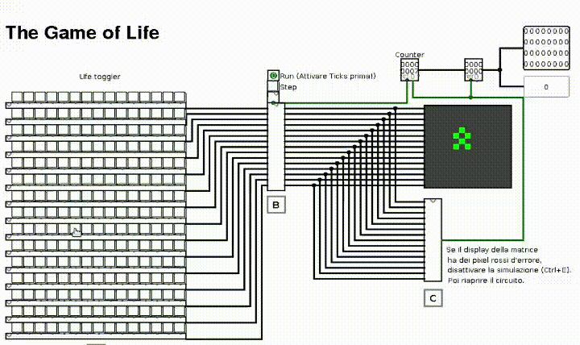
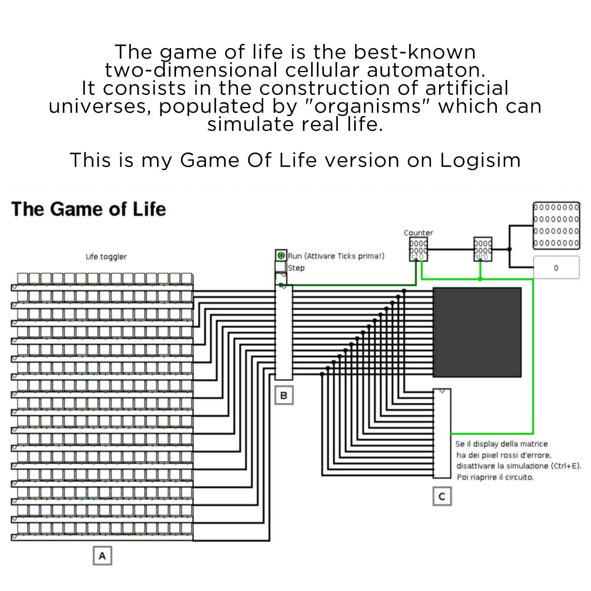
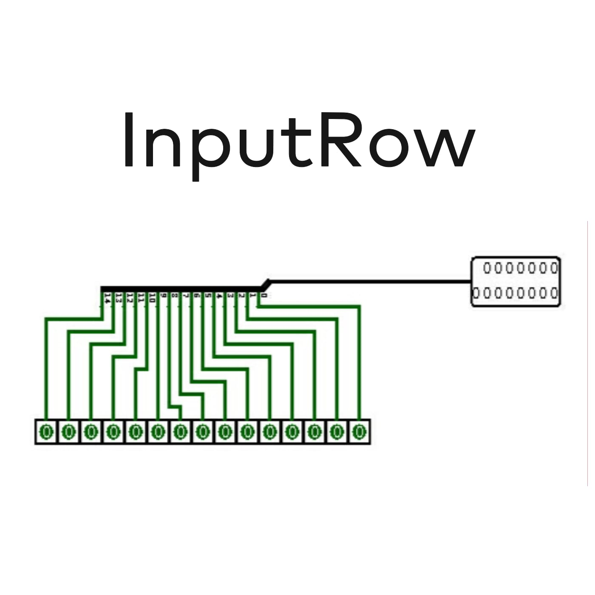
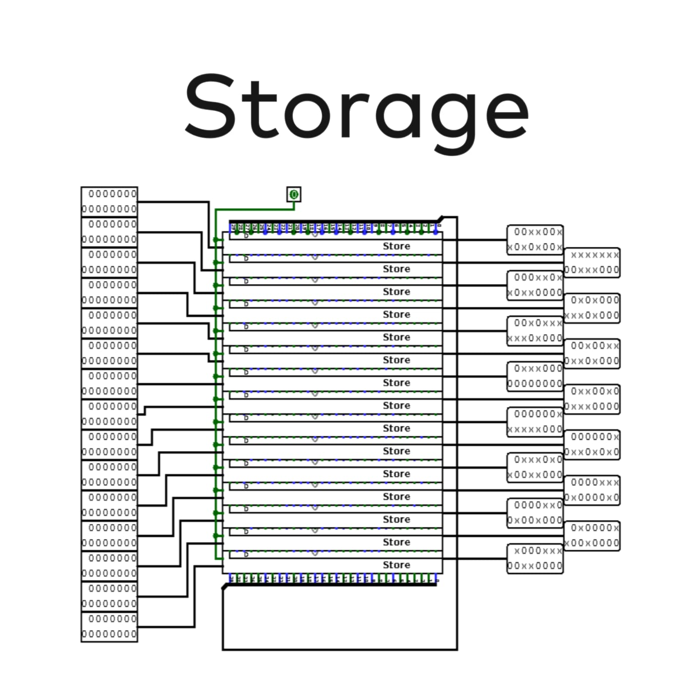
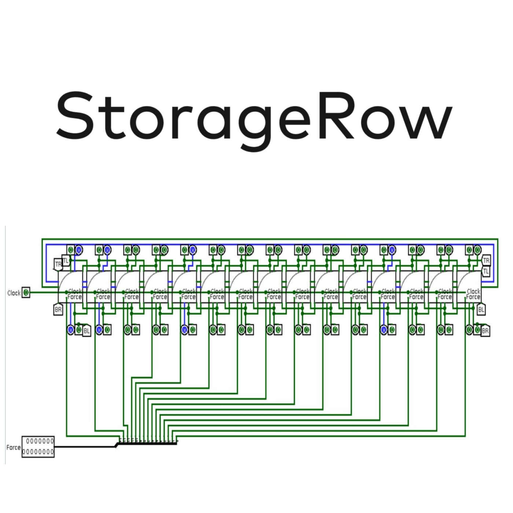
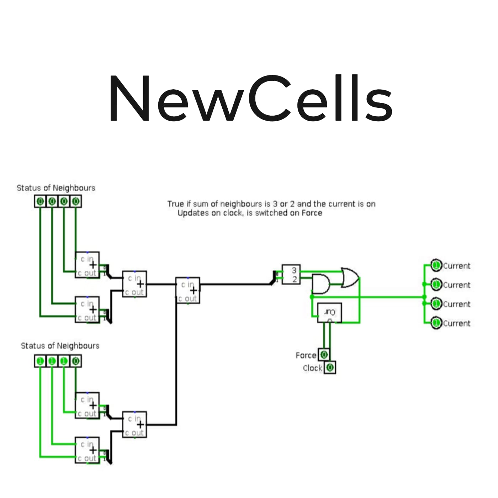
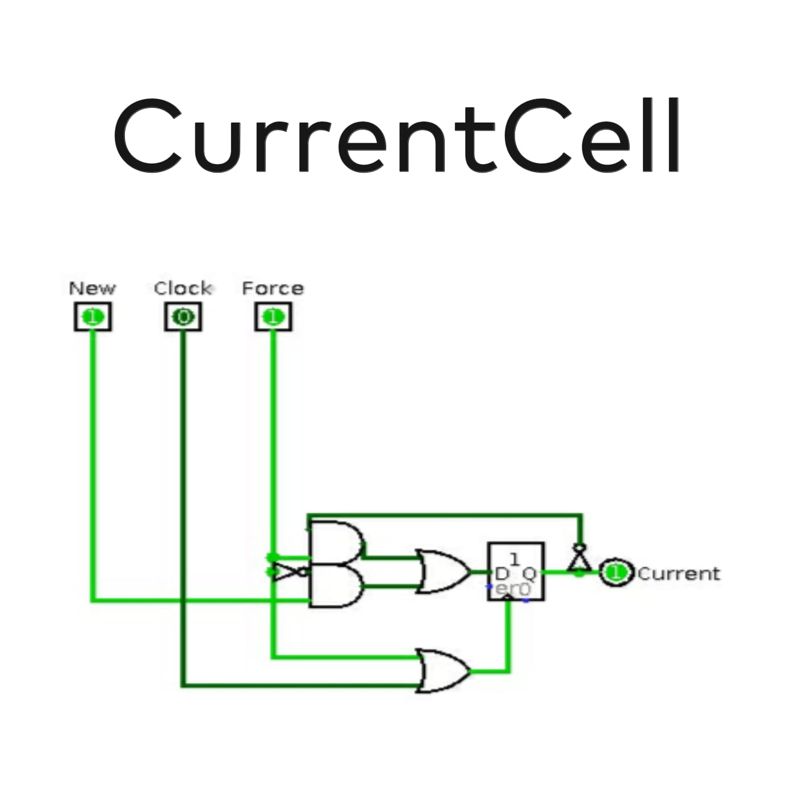
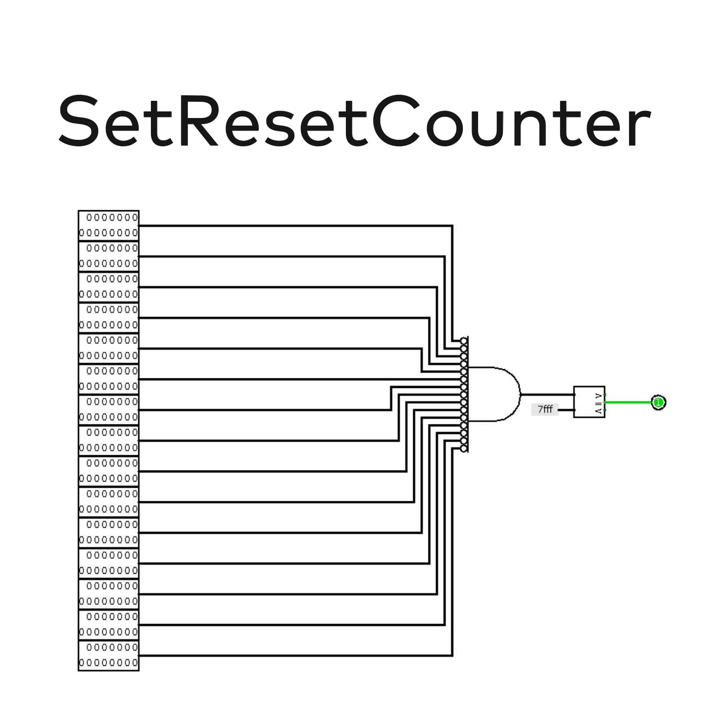

# Game of Life on Logisim

This is my Conway's Game of Life version on Logisim. 
The Game of Life is the best-know two-dimensional cellular automaton. It consist in the construction of artificial universes, populated by organisms wich can simulate real life.

## Demo:



## Built with:

* [Logisim](http://www.cburch.com/logisim/)

## Project

The project consists of creating a Logisim version of Conway's famous cellular automaton: "Game of Life". 
The Game of Life is a cellular automaton that simulates the evolution of a population through rules that establish the life, birth and death of each individual. 
Each cell of a population, passing from the state of life or death, conditions the evolution of the neighboring cells; these interactions cause extremely complex and interesting evolutions.
Cells can be in two possible states: live or dead (1 or 0); in our case they will be colored on the green led matrix if it lives, on black vice versa. Two cells are defined as neighboring if they are connected in one of the 8 possible directions (also diagonally).
The cell evolution rules are the following:
* a live cell remains alive if there are 2 or 3 neighboring live cells (survival)
* a live cell dies if it borders on less than two live cells (insulation) or with more than 3 cells lives (overcrowding)
* a dead cell with exactly 3 neighboring living cells is born and becomes alive (reproduction)
  
## Prerequisites

You should install [Logisim](http://www.cburch.com/logisim/) and [Java](https://www.java.com/). (Logisim requires Java 5 or later)

## Installing

Download or clone the repository, open Logisim or go to terminal and type:

```
java -jar logisim-XX.jar
```

Open Conway's Game of Life.circ and enjoy it. (If the matrix display has red error pixels, disable the simulation -> Ctrl+E. Then open the circuit again.)

## Components

### Preview



### Input Row



### Storage



### Storage Row



### New Cells



### Current Cell



### Set Reset Counter



## Author

* **Alessandro Farè**
